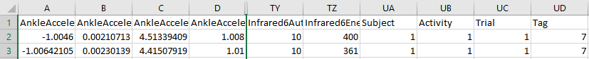
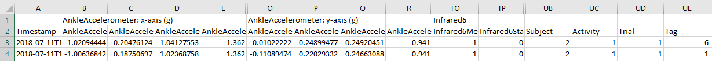

# FeatureExtraction.py

## Instructions

To use our feature extraction process, you'll have to download the python programs located in this folder. To begin extractiong features, just run the **featureExtraction.py** file.

In the following sections, you'll find a more detailed explanation of how to use the available funcitons and what to expect from them.

## Directory arrangement

The feature extraction program works by reading hte desired subject and activity trial files. This means that the program reads individual trial files and not the complete data set file. The directory arrangement required to tun this program is the following:

    ParentFolder\
                \Subject#\
                         \Activity$\
                                   \Trial%\
                                          \Subject#Activity$Trial%.csv

If the program is run as it is, the features will be stored in the same folder as the trial data files, and a single file (containign all features for a specified time window) will be created in the parent folder (where the Subject folders are stored).

  Code used:

    d_base_path = 'ParentFolder//'
    features_path = d_base_path
    extraction(d_base_path,features_path)

  Output arrangement:
  
    ParentFolder\
                \FeaturesTIMEWINDOW.csv
                \Subject#\
                         \Activity$\
                                   \Trial%\
                                          \Subject#Activity$Trial%.csv
                                          \Subject#Activity$Trial%FeaturesTIMEWINDOW.csv

    
 
However, this can be easily changed to a different arrangement, such as:

  Code used:

    d_base_path = 'ParentFolder1//'
    features_path = 'ParentFolder2//'
    extraction(d_base_path,features_path)

  Output arrangement:

    ParentFolder1\
                 \Subject#\
                          \Activity$\
                                    \Trial%\
                                           \Subject#Activity$Trial%.csv
    ParentFolder2\
                 \FeaturesTIMEWINDOW.csv
                 \Subject#\
                          \Activity$\
                                    \Trial%\
                                           \Subject#Activity$Trial%FeaturesTIMEWINDOW.csv

## Choosing a time window

By default, features are calculated for three time windows:

- 1&0.5

- 2&1

- 3&1.5

These time windows can be altered when calling the function **extraction()**. In the following line there's an example showing how to call the function to get features for two windows: 1 second windows, taken every 0.5 seconds; and 2 second windows taken every second.

    extraction(d_base_path,features_path,t_window = ['1&0.5','2&1'])

This will result in:

    ParentFolder\Subject#\Activity#\Trial#\Subject#Activity#Trial#Features1&0.5.csv
                \Subject#\Activity#\Trial#\Subject#Activity#Trial#Features2&1.csv
                \Features1&0.5.csv
                \Features2&1.csv

## Choosing sensors and features

By default, the program gets the features for 42 "sensors":

- 5 IMU sensors, each one with:

  - 3 Accelerometer (x, y and z axis)

  - 3 Angular Velocity (x, y and z axis)

  - Luminosity

- 6 Infrared sensors

- 1 Think-gear sensor

There are 13 default features obtained are:

- Mean

- StandardDeviation

- RootMeanSquare

- MaximalAmplitude

- MinimalAmplitude

- Median

- Number of zero-crossing

- Skewness

- Kurtosis

- First Quartile

- Third Quartile

- Autocorrelation

- Energy

These sensors and features are all listed in **SFt_List.py**, and altering said file will allow you to choose which sensors and features to use. All feature calculations can be found in **fCalculation.py**.

## Choosing subjects, activities and trials

By default, features are taken for **17 subjects**, each with **11 activities** and **3 trials** per activity. These numbers can be modified in the function's input. It is important to note that the progra mis built in a way that only allows to call these objects in order, so for example, if you wanted to get the features of subjects 1, 2, 3, 7, 10 and 11 you would have to call three times the function, and specifiy that you don't want a single output file (because this would erase the previous outputs).

    extraction(d_base_path,features_path, n_sub=[1,3], single_f=False)
    extraction(d_base_path,features_path, n_sub=[7,7], single_f=False)
    extraction(d_base_path,features_path, n_sub=[10,11], single_f=False)
    

To recap:

  For subjetcts:
  
    n_sub = [start, end] 

  For activities:
  
    n_act = [start, end]

  For trials:
  
    n_trl = [start, end]

It should be noted that **start** and **end** both refer to integer numbers.

## Choosing different header formats

We have two available header formats:

1.

  
  
  
  To get this header the **extraction** function should just be called as usual:
  
  
    extraction(d_base_path,features_path)

2. 

  

  This header requires a flag to specify that timestamps are wanted. To get it, the **extraction** function should be called as:
  
  
    extraction(d_base_path,features_path, t_stamp = True)
