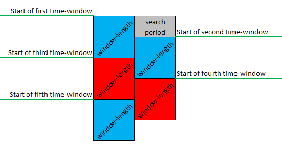

# HAR-UP
## Multimodal System for Fall Detection

In this repository you'll be able to find the python programs used for the Universidad Panamericana's Multimodal System for Fall Detection.
 These are all written  in python.
 
We have programs to help downloading our database and for feature selection, training and validation.

## Relevant links

The following hyperlinks will redirect you to our work, where you'll find our research's website and published articles.

- [UP's Human Activity Recognition website](https://sites.google.com/up.edu.mx/har-up/p%C3%A1gina-principal)
- [Sensors article: *UP-Fall Detection Dataset: A Multimodal Approach*](https://www.mdpi.com/1424-8220/19/9/1988)
- [IEEE article: *Challenges in Data Acquisition Systems: Lessons Learned from Fall Detection to Nanosensors*](https://ieeexplore.ieee.org/document/8688609)

## System Requirements

To properly use the programs in this repositories you'll need to have a **Python 3.7** distribution. We recomend using [Anaconda](https://www.anaconda.com/distribution/).

## Important concepts

### Subjects, activities and trials

Our experimetns were done with 17 subjects (young and healthy) performing 11 different activities. There were three trials for each one of these activities. For more information on our data set visit https://sites.google.com/up.edu.mx/har-up/p%C3%A1gina-principal.

Throught the programs, you'll find the following varialbes refering to these concepts:

    n_sub
    n_act
    n_trl

These are all integer arrays, indicating the first and last subject, activity or trial to be used when calling a funtction.

### Time-windows

Features were calculated using three different time-windows: 1&0.5, 2&1 and 3&1.5. For each time-window, the first number refers to the window-length (in seconds) in which the features were calculated, while the second number to the period (also in seconds) in which a new calculation was done. This is illustrated in the following image:

Throught the programs, you'll be able to select which time-windows to use with the variable:

    t_window

This is a string array, stating the window-length and period for each time-window (e.g. such as '1&0.5').

### Methods

Trainign and validation were performed using four different classification models:

 - Random Forest (RF)
 - Support Vector Machines (SVM)
 - Multilayer Perceptron Neural Network (MLP)
 - K-Nearest Neighbour (KNN)

These were all taken from [scikit-learn](https://scikit-learn.org/stable/).

You'll be able to choose which one of these to use when modifying the following variable:

    methods

This is a string array, stating the methods with their abbreviations (e.g. 'RF').

### Concepts

For feature selection, training and validation different sensor combinations (or experiments) were taken into account. To keep order, we started using each experiment's name (the **concept**) as a differentiator.

You'll be able to select which experiments or concepts you are working with at the moment by modifying the variable:

    concept

This is a string array, stating the used experiments (e.g. 'IMU_Head_IR' could be used to name an experiment consisting of IMU, the ECG and infrared sensors).

## Our process

The available programs were used in the following manner and order:

1. First of all, the desired features were placed in a csv file.

2. A (preliminar) feature selection process was made. To select the features, [Weka](https://www.cs.waikato.ac.nz/~ml/weka/index.html) was used, with attribute selection using Explorer mode and 10 folds for the selection, with the following models:

					-CfsSubsetEval_BestFirst (with ZeroR set as the classifier)
					
					-SubSetEval_Greedysepwise (with ZeroR set as the classifier)
					
					-CorrelationAttributeEval_Ranker (with ZeroR set as the classifier)
					
					-ClassifierAttributeEval_Ranker (with DecisionTable set as the classifier)
     
3. After the first feature selection was completed, the selected features were written in a new csv file.

4. Having the new csv file, the selected features were placed in a second selection process. This time Random Forest was used, to train a model with the all the selected features. After training, features were added (one at a time) to see which features were the most relevant.

5. The results were then evaluated, and their scores were analyzed to finish the second selection process.

6. Using the selected features (from the second selection process), the real training could be started. This was done by training the four different models (RF, SVM, KNN, MLP) with random data. 70% of the data base was used for training, leaving the remaining 30% for validation. This was done ten times for all the modles (ten training and validation sets were made for the four models, for each one of the time windows). 

7. After validation was completed, scores were obtained for said validation.

## Citation

**If you use our [data set](https://sites.google.com/up.edu.mx/har-up/p%C3%A1gina-principal), please cite as follows:**

*Lourdes Martínez-Villaseñor, Hiram Ponce, Jorge Brieva, Ernesto Moya-Albor, José Núñez-Martínez, Carlos Peñafort-Asturiano, “UP-Fall Detection Dataset: A Multimodal Approach”, Sensors 19(9), 1988: 2019, doi:10.3390/s19091988.*
